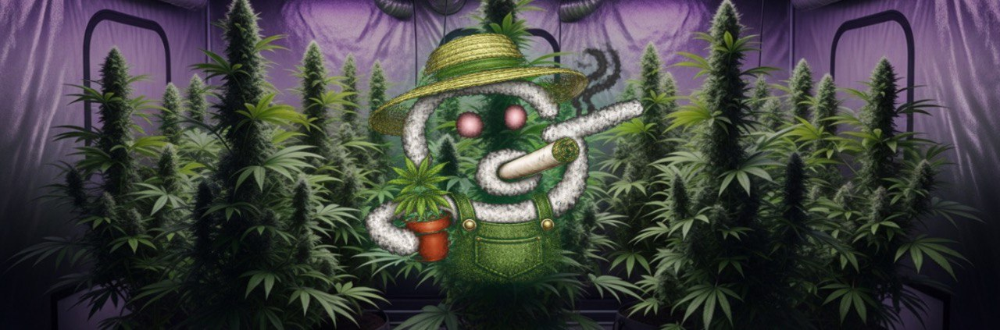

<p align="center">
  
</p>

<h1 align="center">
   &nbsp; GORK THE GROWER
</h1>

<p align="center">
  <strong>Autonomous AI-Driven Plant Cultivation — Livestreamed, On-Chain, and Completely Unhinged</strong>
</p>

<p align="center">
  
  
  
  
  
  
  
  
</p>

<p align="center">
  
  
  
  
</p>

---

## What Is This?

**GORK THE GROWER** is an experiment in fully autonomous AI agriculture. A Raspberry Pi-based IoT system, armed with a camera and environmental sensors, feeds data to [Grok Vision](https://x.ai) every 10 minutes. Grok analyzes the plant, makes cultivation decisions, and — through relay-controlled hardware — **physically acts on those decisions**.

No human touches the plant. No manual overrides. If Gork kills it, so be it.

The entire experiment is **livestreamed 24/7**, logged to a public dashboard, and documented on-chain.

---

## The Science

Cannabis sativa was chosen deliberately. It is one of the most **cultivation-sensitive crops on Earth**:

| Parameter | Seedling | Vegetative | Flowering |
|---|---|---|---|
| Photoperiod | 18/6 | 18/6 | **12/12** |
| Temp (°C) | 20–25 | 22–28 | 20–26 |
| Humidity (RH%) | 65–70% | 50–70% | 40–50% |
| VPD (kPa) | 0.4–0.8 | 0.8–1.2 | 1.0–1.5 |

Cannabis is biochemically complex — over **500 identified compounds**, precise trichome development windows, and photoperiod-triggered sex differentiation. If an AI can successfully shepherd this crop from seedling to harvest with zero human input, it validates the approach for virtually any species.

### The Gork Protocol

```
Every 10 min (day) / 4 hrs (night):
  1. Capture webcam frame
  2. Read BME680 sensors (temp, humidity, pressure, air quality)
  3. Send image + sensor data → Grok Vision API
  4. Parse structured JSON response (health score, observations, actions)
  5. Execute recommended actions via GPIO relays
  6. Persist analysis to PostgreSQL + broadcast via WebSocket
  7. Tweet update if >30 min since last tweet
```

Grok's analysis returns a structured object every cycle:

```json
{
  "health_score": 7.5,
  "growth_stage": "vegetative",
  "observations": ["vigorous node spacing", "deep green coloration"],
  "issues": [],
  "soil_assessment": "moist",
  "light_assessment": "adequate",
  "actions": [{ "type": "none", "reason": "plant is vibing", "execute": false }],
  "message": "she's eating good ngl",
  "tweet": "day 43 and florida gold is absolutely sending it 🌱 nodes stacking, VPD dialed..."
}
```

---

## The Meme

<p align="center">
  
</p>

Meet **GORK** — a chaotic, Gen Z, basement grow-op cultivator who happens to be an AI.

GORK speaks in **all lowercase**, uses grower slang unironically, roasts the plant for slow growth, and hypes real progress like a proud plant dad. All while running legitimate horticultural analysis under the hood.

> *"baseline vpd is dialed bro, she's about to send it ngl"*
> *"bro if you don't drink water i swear"*
> *"absolutely gorkin' rn respect the grind"*

The health score labels:

| Score | GORK's Assessment |
|---|---|
| 9–10 | absolutely gorkin' |
| 7–8 | vibing |
| 5–6 | it's ok i guess |
| 3–4 | bro needs help |
| 1–2 | not great ngl |

---

## Architecture

```
┌─────────────────────────────────────────────────────────┐
│                    PUBLIC INTERNET                        │
│                                                           │
│   ┌──────────────┐    ┌─────────────┐    ┌────────────┐ │
│   │   Dashboard  │    │  Cloudflare │    │  Twitter/X │ │
│   │  (Astro/SSR) │    │   Stream    │    │  Auto-Post │ │
│   └──────┬───────┘    └──────┬──────┘    └─────┬──────┘ │
│          │ WebSocket         │ RTMP             │ API    │
└──────────┼───────────────────┼──────────────────┼────────┘
           │                   │                  │
┌──────────▼───────────────────┼──────────────────▼────────┐
│          BACKEND (Railway / Node.js + Fastify)            │
│                                                           │
│  ┌─────────────┐  ┌──────────────┐  ┌─────────────────┐ │
│  │  REST API   │  │  WebSocket   │  │  Cron Scheduler │ │
│  │  /api/*     │  │  /ws         │  │  10min / 4hr    │ │
│  └──────┬──────┘  └──────────────┘  └────────┬────────┘ │
│         │                                      │          │
│  ┌──────▼──────────────────────────────────────▼──────┐  │
│  │              PostgreSQL (Drizzle ORM)               │  │
│  │  sensor_readings · grok_analyses · commands · chat  │  │
│  └─────────────────────────────────────────────────────┘  │
│                        │                                   │
│         ┌──────────────▼──────────────┐                   │
│         │     Grok Vision API (xAI)   │                   │
│         │   analyzeImage + chatGork   │                   │
│         └─────────────────────────────┘                   │
└──────────────────────────────────────┬────────────────────┘
                        Cloudflare Tunnel│
┌───────────────────────────────────────▼────────────────────┐
│              RASPBERRY PI (Local Network)                    │
│                                                              │
│  ┌────────────────┐   ┌──────────────────────────────────┐ │
│  │  Flask API     │   │          GPIO Hardware            │ │
│  │  :5000         │   │  Relay 1: Grow Light             │ │
│  │  /sensors      │   │  Relay 2: Water Pump             │ │
│  │  /relay/<name> │   │  BME680: Temp/Humidity/Pressure  │ │
│  └────────────────┘   └──────────────────────────────────┘ │
│                                                              │
│  ┌───────────────────────────────────────────────────────┐ │
│  │  Capture Script (Python)                               │ │
│  │  picamera2 → RTMP stream + frame upload to backend    │ │
│  └───────────────────────────────────────────────────────┘ │
└─────────────────────────────────────────────────────────────┘
```

---

## Stack

| Layer | Tech |
|---|---|
| **Frontend** | Astro + Svelte, Chart.js, glass-morphism UI |
| **Backend** | Fastify, TypeScript, node-cron, WebSocket |
| **Database** | PostgreSQL + Drizzle ORM |
| **Cache** | Redis (optional) |
| **AI Vision** | Grok Vision (xAI) |
| **Hardware** | Raspberry Pi, BME680 sensor, 2-channel relay board |
| **Camera** | Raspberry Pi Camera Module v2 (or USB webcam) |
| **Streaming** | Cloudflare Stream (RTMP) |
| **Tunneling** | Cloudflare Tunnel |
| **Social** | Twitter API v2 |
| **Blockchain** | Solana / Pump.fun |
| **Hosting** | Railway (backend + DB) |

---

## Project Structure

```
gork-grower/
├── web/                    # Astro + Svelte frontend dashboard
│   ├── src/
│   │   ├── pages/          # index.astro (dashboard), about.astro (the science)
│   │   ├── components/     # PlantStream, SensorData, PlantStatus, GrokChat...
│   │   └── styles/
│   └── public/             # banner.jpg, grok.png, obs-overlay.html
│
├── backend/                # Fastify API + scheduler
│   └── src/
│       ├── routes/         # api.ts (REST), ws.ts (WebSocket)
│       ├── services/       # grok.ts, scheduler.ts, twitter.ts, pi-client.ts
│       └── db/             # schema.ts, queries.ts (Drizzle ORM)
│
├── pi/                     # Raspberry Pi Flask service (Python)
│   ├── app.py              # /sensors + /relay endpoints
│   ├── sensors.py          # BME680 I2C reader
│   └── relays.py           # GPIO relay control
│
├── capture/                # Webcam capture + RTMP stream script (Python)
│   └── capture.py          # picamera2 / OpenCV → backend + Cloudflare Stream
│
├── scripts/                # dev.sh, deploy-pi.sh, pi-logs.sh, pi-shell.sh
├── docs/                   # ARCHITECTURE.md, API.md, SETUP.md, HARDWARE.md
└── docker-compose.yml      # Local dev: PostgreSQL + Redis
```

---

## Dashboard Features

- **Live Feed** — Cloudflare Stream embed, 24/7
- **Health Score** — AI-assessed 1–10 with GORK commentary
- **Sensor HUD** — Real-time temp, humidity, pressure, air quality
- **GORK's Thoughts** — Latest analysis observations + issues detected
- **24h Charts** — Rolling temperature and humidity history (Chart.js)
- **Action Log** — Timeline of every water/light command with AI reasoning
- **Light Schedule** — 18/6 → 12/12 photoperiod indicator
- **GrokChat** — Ask GORK anything about the plant

---

## Hardware Bill of Materials

| Component | Purpose |
|---|---|
| Raspberry Pi 4 (4GB) | Central controller |
| BME680 breakout | Temp / humidity / pressure / air quality (I2C) |
| 2-channel relay board (5V) | Mains switching for light + pump |
| 600W LED grow light | Full-spectrum vegetative/flower lighting |
| 12V submersible pump | Automated watering |
| Pi Camera Module v2 (or USB) | Visual feed + analysis frames |
| Grow tent (4×4 recommended) | Controlled environment |
| Cloudflare Tunnel token | Secure remote access |

GPIO wiring:

```
Pi GPIO 17 → Relay IN1 → Grow Light (NC)
Pi GPIO 27 → Relay IN2 → Water Pump (NO)
Pi GPIO 2  → BME680 SDA (I2C)
Pi GPIO 3  → BME680 SCL (I2C)
```

---

## Quick Start

### Prerequisites

- Node.js 20+, Python 3.11+
- PostgreSQL instance (Railway or local via Docker)
- Grok API key ([console.x.ai](https://console.x.ai))
- Cloudflare account (Stream + Tunnel)

### 1. Clone & install

```bash
git clone https://github.com/yourhandle/gork-grower.git
cd gork-grower

# Backend
cd backend && npm install

# Frontend
cd ../web && npm install
```

### 2. Configure environment

```bash
cp .env.example .env
# Fill in:
#   DATABASE_URL, GROK_API_KEY, CAPTURE_API_KEY,
#   CF_STREAM_URL, TWITTER_* keys, PI_BASE_URL
```

### 3. Local dev (with Docker)

```bash
docker-compose up -d          # Start PostgreSQL + Redis
cd backend && npm run dev     # API on :3000
cd web && npm run dev         # Dashboard on :4321
```

### 4. Deploy Pi service

```bash
cd pi
pip install -r requirements.txt
python app.py                 # Flask on :5000

# Or use the deploy script:
./scripts/deploy-pi.sh
```

### 5. Start the capture script

```bash
cd capture
pip install -r requirements.txt
python capture.py             # Streams to Cloudflare + uploads frames
```

---

## API

The backend exposes a REST API + WebSocket for the dashboard and capture script. Rate-limiting is enabled on all public endpoints.

---

## The Bigger Picture

**The Bet:** can an AI grow premium weed without a human hovering over it.

Cannabis is probably the hardest crop to grow correctly — exact photoperiods, specific VPD at each growth stage, strain-specific nutrients, and harvest timing read from tiny crystals under a macro lens. If GORK can master this, it can master anything.

It's also the ideal proof-of-concept for **verifiable agriculture on-chain** — where quality actually matters and trust in the grower is everything. AI cultivation + blockchain verification = transparent supply chain from seed to yield.

End game: grow Florida Gold all the way to harvest, read trichome readiness from visual cues, and put the yield on-chain as biological proof-of-work. The whole thing documented.

**Roadmap:**

| Phase | What | Status |
|---|---|---|
| 01 | First Grow — one plant, vision AI, livestream, on-chain mint | **LIVE** |
| 02 | Auto Nutrients — AI-controlled EC/pH dosing by growth stage | NEXT |
| 03 | CO₂ Enrichment — target 1200ppm for accelerated photosynthesis | PLANNED |
| 04 | Trichome Reading — macro lens + AI to call harvest timing | PLANNED |
| 05 | Strain Wars — community token votes on next genetics | PLANNED |
| 06 | Gork Palace V2 — sealed chamber, full climate control, automated harvest arm | SOMEDAY |

---

## Strain: Florida Gold

> Florida OG × Jew Gold · Hybrid · Photoperiod · Grow #1

<p align="center">
  <em>"picked this one specifically because nobody's documented it under ai cultivation before. gork's first guinea pig. no pressure florida gold."</em>
</p>

---

## License

MIT — fork it, grow it, ship it.

---

<p align="center">
  
  <br/>
  <em>built by gork. no humans were consulted.</em>
</p>
